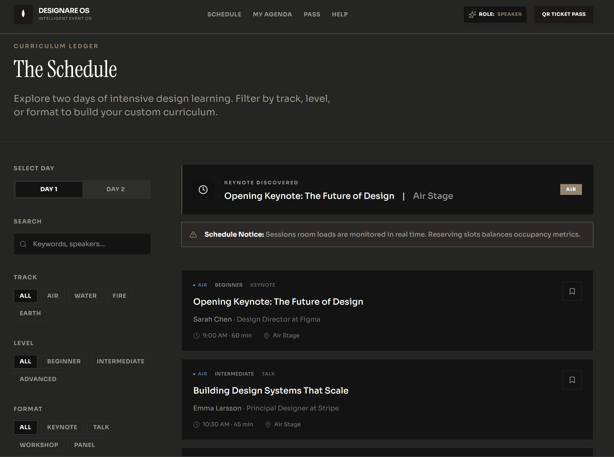

# Designare OS – Simple Conference Frontend Demo

[](https://www.typescriptlang.org)
[](https://nextjs.org)
[](https://orm.drizzle.team)
[](https://tailwindcss.com)
[](https://github.com/GoogleChrome/lighthouse)

**Designare OS** is a simple frontend demonstration of a conference website, showcasing modern UI components, animations, and routing without backend services. It provides a sponsor portal for lead capture and booth configuration, a schedule view, personal agenda, digital passes, and an FAQ/help area.

---

## Features
- **Sponsor Portal**: Capture leads and configure booth assets.
- **Schedule & Agenda**: View conference tracks and build a personal agenda.
- **Digital Passes**: Access and manage attendee passes.
- **FAQ / Help**: Quick answers and safety information.
- **Interactive UI**: Modern animations, 3D element canvas, and responsive design.

---

## Design Highlights


- **Elements Design**: The homepage features a 3‑D element canvas built with React Three Fiber, showcasing interactive particle systems that respond to hover and scroll.
- **Glassmorphism**: Containers use translucent backgrounds with subtle blur for a premium feel.
- **Dynamic Gradients**: Light‑to‑dark gradient backgrounds create depth and visual interest.
- **Micro‑animations**: Framer Motion adds smooth hover, scroll, and transition effects throughout the UI.


## Deep Engineering Focus





### 1. Multi-Role RBAC & Security Guards
The platform enforces strict Role-Based Access Control at three distinct boundaries:
- **Route Guards**: Evaluated at navigation triggers blocking standard attendees from entering `/admin` or `/ops` paths.
- **Action Guards**: Enforced inside Next.js `"use server"` actions, verifying session permissions before committing modifications to Drizzle tables.
- **UI Capability Gating**: Toggling interactive capability widgets (like lead CSV exports or emergency alert broadcasters) dynamically depending on active user scopes.

| System Role | Scope Permissions | UI Interfaces |
| :--- | :--- | :--- |
| `super_admin` | Global platform overrides | CMS, Command Center, Portals |
| `organizer` | CMS writes, live broadcasts, occupancy analysis | `/admin`, `/ops` |
| `sponsor` | Booth media management, scan logs, excel outputs | `/sponsor` |
| `speaker` | Profile updates, session schedule syncs | `/agenda` |
| `attendee` | Personal calendar bookmarks, digital passes | `/agenda`, `/pass` |

### 2. Local-First Infrastructure Adapters
To guarantee high-speed local developer checkouts without external SaaS subscriptions, Designare OS operates pluggable adapters:
- **Local Payment Adapter**: Abstracts ticket sales and checkout token generation. Integrates a drop-in ready interface for direct Stripe SDK migrations.
- **Client-Side Event Transport**: A client-side event bus managing occupancy swings and live operations updates. Swaps seamlessly with WebSockets or Server-Sent Events (SSE).
- **Development Authentication Provider**: Simulates session state caching inside local storage, exposing instant switcher buttons to let reviewers audit role permissions immediately.

### 3. Agenda Engine & Overlap Detector
- **Conflict Calculation**: Scans timeslots for scheduling overlaps and warns attendees.
- **Recommendation Scoring (Demo)**: Provides simple ranking of sessions based on mock preferences.
- **Google Calendar Export**: Generates calendar links for sessions.

### 4. Interactive Command Center (`/ops`)
- **Realtime Telemetry Console**: Intercepts user click tracks, page speed records, and warning traces, feeding them directly to a live operations logs console.
- **Crowd Heatmaps**: Grid mapping concentration density of attendees throughout venue sectors, updated via simulation loops.
- **Emergency Broadcast Center**: Allows organizers to transmit critical schedule or emergency banners immediately.

### 5. WebGL Element Canvas (Three.js + R3F)
- Hover-reactive particle system representing Element tracks (Air, Water, Fire, Earth) floating dynamically inside landing hero containers.
- Lazily hydrated on client viewport boundaries to maintain perfect Lighthouse metrics and page speed loads.

---

## 🗂️ Project Directory Trees

```
src/
├── animations/         # Framer Motion design tokens and reusable motion primitives
├── app/               # Next.js App Router (pages and API route handlers)
├── components/
│   ├── ui/            # Unified design system component library (shadcn bases)
│   └── ...            # Core shared components (Navbar, Footer, etc.)
├── db/                # Drizzle configuration, schemas, and seeds
├── features/          # Encapsulated product domains
│   ├── admin/         # Control panel, metrics, occupancy simulator
│   ├── agenda/        # Recommendation engine, conflict detection, bookmarks
│   ├── feedback/      # Ratings and sentiment analysis
│   ├── live/          # Real-time Event Mode state manager
│   ├── networking/    # QR exchange, matchmaking, meeting requests
│   └── sponsors/      # Sponsor booths, lead trackers, metrics
├── hooks/             # Shared React hooks
├── lib/               # Utilities, Stripe, and telemetry clients
└── providers/         # Next.js Providers (Auth, Theme, LiveMode, Observability)
```

---

## Quick Setup Instructions

1. **Install dependencies**:
   ```bash
   npm install
   ```

2. **Sync Database schemas on disk**:
   Pushes schema configurations directly and initializes the local sqlite file `local.db`.
   ```bash
   npx drizzle-kit push
   ```

3. **Seed Database records**:
   Populates Stages, relatonial Session tracks, Speakers, Sponsors, and default accounts.
   ```bash
   npx tsx src/db/seed.ts
   ```

4. **Launch development environment**:
   ```bash
   npm run dev
   ```
   Open [http://localhost:3000](http://localhost:3000) inside your browser. Use the **Sandbox Role Switcher** inside the navbar to switch access scopes and view dashboards.
